# Doclytic - A Unified Document Intelligence System

Doclytic is a unified document ecosystem that uses OCR and deep learning to extract, classify, summarize, and route documents automatically to relevant departments, improving efficiency and accuracy in handling large volumes of paperwork.

---

## Key Features

* **OCR-Based Document Processing** – Extract text from scanned documents and images
* **AI-Powered Classification** – Automatically categorize documents as per their departments.
* **Quick Extract Summarization** – Generate concise summaries
* **Multi Document Summarization** – Generate combined summaries of multiple docs based on time and priority.
* **Detailed Analysis of any document** – Generate detailed analysis of docs.
* **RAG based chat system** – Querying over docs
* **Automated Routing** – Send documents to relevant departments
* **Authentication System** – Secure login with JWT & Google OAuth
* **Real-time Updates** – WebSocket integration for live updates
* **Live commenting** – Open discussion panel for the people of same departments to communicate.
* **Gmail-routing** - Routes the uploaded documents to mail employee's automatically (based on which department the doc belongs to) along with their summaries.

---

## 📸 Screenshots

### Login Page

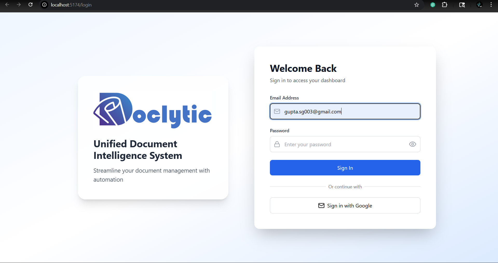
This shows the login page of Doclytic.

### My Profile

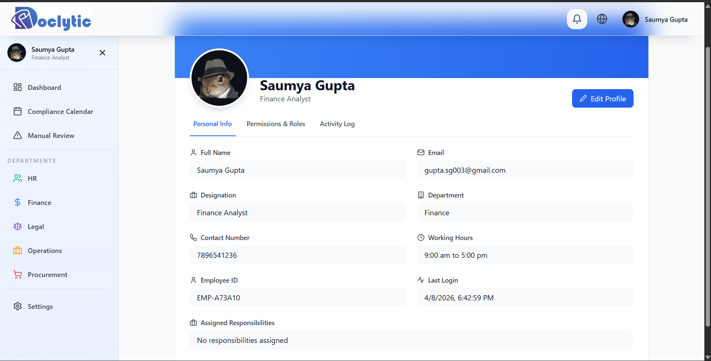
My profile page shows the detail of the employees. 

### Dashboard

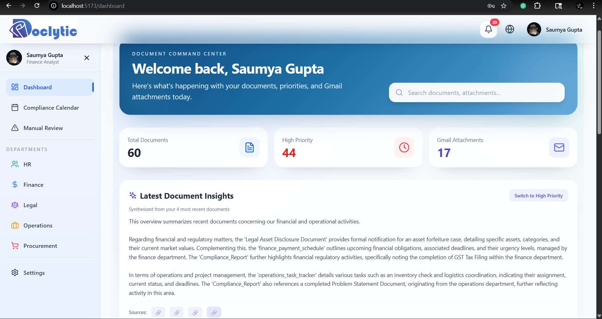
Latest docment insights shows the combined summary of 4 most recent documents, you can switch to the combined summary of 4 most high priority docs as well by clicking the toggle button. Through the side bar, you can navigate to compliance calendar, manual reviewing of the docs, and departmental doc page.

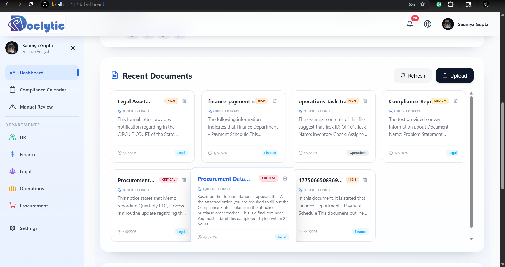
Under the recent documents, you can upload your docs, and you can just hover over any of them to see a quick summary of each one of them so that u dont have to open a doc for getting a gist of it. Moreover, it shows the priority done on the basis of scoring of docs as per their sender, department, etc. The classifier classifies every doc to their respective departments.

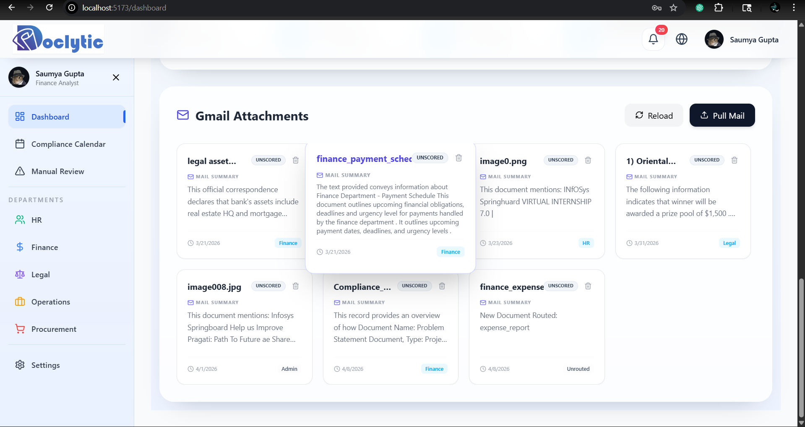
This ss shows how the system allows you to fetch unread documents from your mail- making this whole process just one click away.

### Compliance Calendar

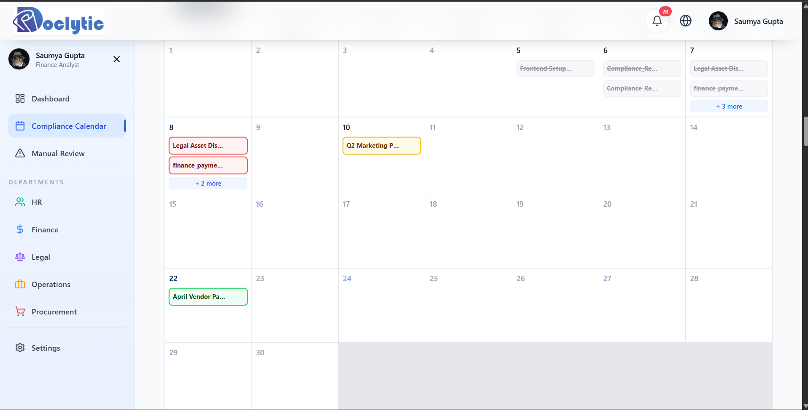
Right after the documents are uploaded or fetched, they directly get routed to the compliance calendar which makes the organization of documents easy.

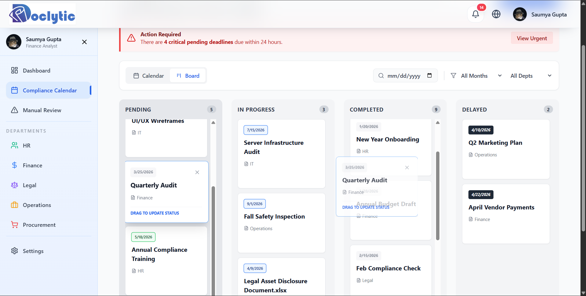
Added a kanban board to provide clear visualization, and make the process of updating the status of any document easy, just drag and drop the doc from one column to another to update their status.

### Gmail Fetch

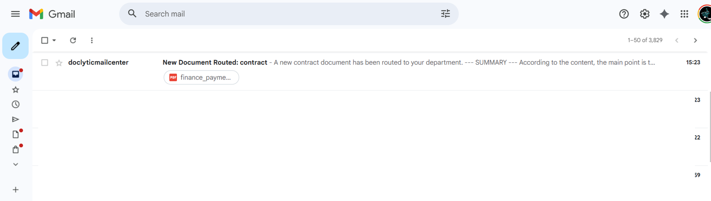
This ss shows the routing of doc from Doclytic to our mails. If someone uploads a doc of finance department, and I am in finance, i'll receive the mail and others will not. Similarly if someone uploads a doc of legal department, i wont receive it.

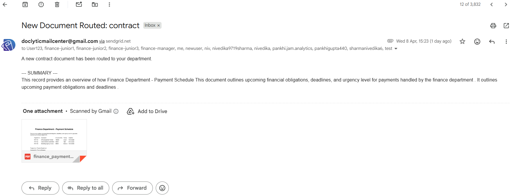
The routed document shows the summary of the doc and an attachment.

### Document Detail Dashboard

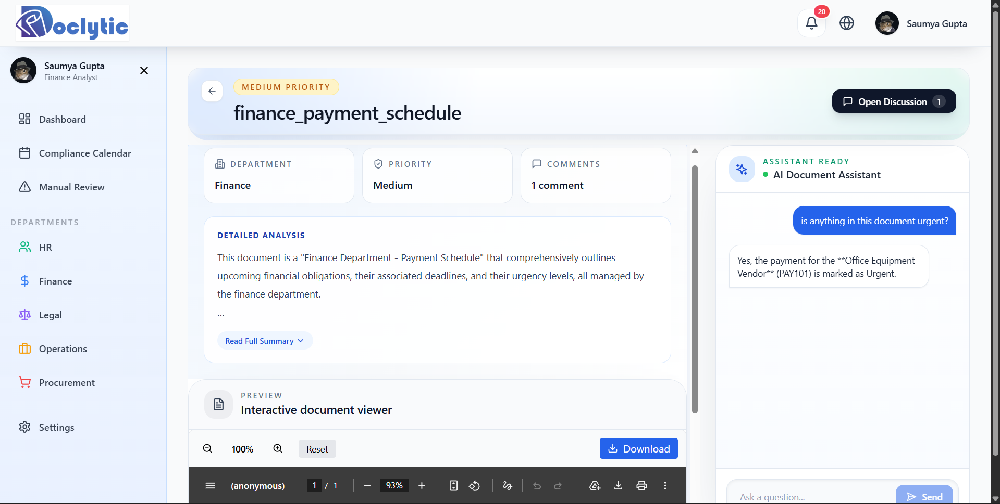
Once you open any document, you can see a detailed analysis of it - where you can get key insights from it and main takeaways.

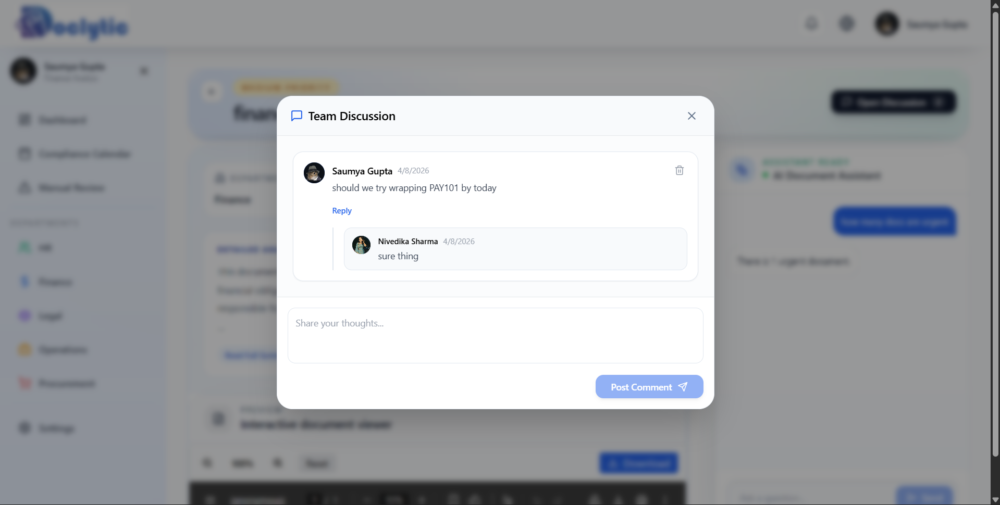
There is an option for open discussion where you can comment on any document and anyone from your department can see and reply to your comment.

### RAG based chat

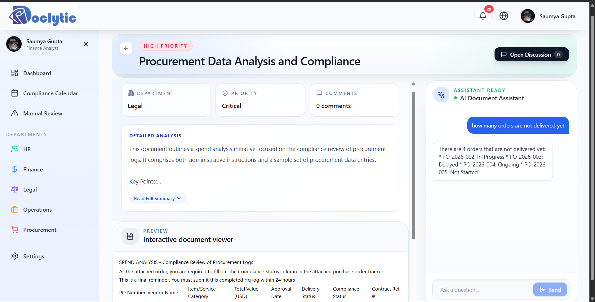
The RAG based chat allowes u to ask any specific questions related to the document and it will answer your questions straight forward.

---

## 🎥 Demo

👉 **Watch Full Working Demo:**

[Google Drive Demo Link](PASTE_YOUR_DRIVE_LINK_HERE)

---

## 🛠 Prerequisites

Node.js (v18+)
Python (3.9+)
MongoDB (Local or Atlas)
API Keys: Gemini, Groq, and Google Cloud Console

---

## ⚙️ Environment Setup

You must create .env files in both the Backend and Frontend directories.

### 1. Backend Environment (/Backend/.env)

```
# Database & Auth
MONGO_URI=your_mongodb_connection_string
JWT_SECRET=your_random_secret_string
CORS_ORIGINS=http://localhost:5173
FRONTEND_URL=http://localhost:5173

# AI Model Keys
GEMINI_API_KEY=your_key
GOOGLE_MULTI_SUMMARIZER_API_KEY=your_key
DETAILED_ANALYSIS_GROQ_KEY=your_key
# ... (Add all other Gemini/Groq keys here)

# Google OAuth
GOOGLE_CLIENT_ID=your_id.apps.googleusercontent.com
GOOGLE_CLIENT_SECRET=your_secret
GOOGLE_REDIRECT_URI=http://localhost:5000/auth/google/callback
```

### 2. Frontend Environment (/Frontend/.env)

```
VITE_API_URL=http://localhost:5000
```

---

## 🚀 Getting Started

To run this system, you need to open three separate terminals.

### 🟦 Terminal 1: Node.js Backend (Auth & Logic)

```
cd Backend
npm install
node src/server.js
```

### 🟨 Terminal 2: Python Backend (AI & RAG)

```
cd Backend

# Create and activate virtual environment
python -m venv venv
.\venv\Scripts\activate   # Windows
source venv/bin/activate    # Mac/Linux

# Install dependencies
pip install -r requirements.txt

# Start the AI Service
cd python-backend
uvicorn app:app --reload --port 8000
```

### 🟩 Terminal 3: React Frontend (UI)

```
cd Frontend
npm install
npm run dev
```

---

## 🏗 System Architecture

The project uses a Hybrid Backend Strategy:

Node.js (Express): Handles User Authentication, MongoDB CRUD, and WebSockets.
Python (FastAPI): Handles RAG (Retrieval-Augmented Generation), Gemini/Groq AI processing, and heavy document analysis.
React (Vite): Provides a modern, responsive interface using Tailwind CSS and Framer Motion.

---
